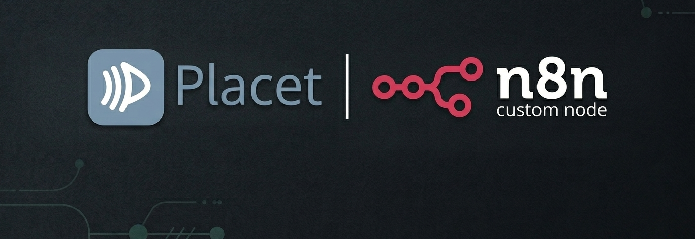

<p align="center">
  
</p>

<p align="center">
  <strong>Human-in-the-Loop for your n8n workflows.</strong><br/>
  Community nodes for <a href="https://github.com/centerbitco/placet">Placet</a> — the open-source HITL platform.
</p>

<p align="center">
  
  
  
  
</p>

<p align="center">
  <a href="https://docs.placet.io">Documentation</a> · <a href="#installation">Installation</a> · <a href="#operations">Operations</a> · <a href="https://github.com/centerbitco/placet">Placet GitHub</a>
</p>

---

## Nodes

| Node               | Description                                                                                                               |
| ------------------ | ------------------------------------------------------------------------------------------------------------------------- |
| **Placet**         | Send messages, request approvals / selections / forms / text input / plugin reviews, manage files, and check agent status |
| **Placet Trigger** | Poll for new messages in a channel (polling trigger)                                                                      |

## Installation

Follow the [installation guide](https://docs.n8n.io/integrations/community-nodes/installation/) in the n8n community nodes documentation.

### Manual

```bash
cd ~/.n8n/nodes
npm install n8n-nodes-placet
```

Then restart n8n.

## Credentials

1. Open your Placet dashboard → **Settings → API Keys**
2. Create a new API key (starts with `hp_`)
3. In n8n, go to **Credentials → New → Placet API**
4. Enter your **API Key** and **Base URL** (e.g. `https://placet.example.com`)

## Operations

### Message

| Operation                 | Description                                                                |
| ------------------------- | -------------------------------------------------------------------------- |
| **Send**                  | Send a text message to a channel                                           |
| **Request Approval**      | Send approval buttons (Approve / Reject or custom) and wait for a response |
| **Request Selection**     | Send a selection list (single or multi-select) and wait                    |
| **Request Form**          | Send a dynamic form with typed fields and wait                             |
| **Request Text Input**    | Send a free-form text / markdown input and wait                            |
| **Request Plugin Review** | Send a plugin-based review with dynamically loaded fields and wait         |
| **Get**                   | Get a message by ID                                                        |
| **Get Many**              | List messages in a channel                                                 |
| **Delete**                | Delete a message                                                           |

### Review

| Operation       | Description                |
| --------------- | -------------------------- |
| **Get Pending** | List all pending reviews   |
| **Get**         | Get a review by message ID |

### File

| Operation    | Description                      |
| ------------ | -------------------------------- |
| **Upload**   | Upload a file (from binary data) |
| **Download** | Download a file as binary data   |
| **Get Many** | List uploaded files              |

### Agent Status

| Operation | Description                             |
| --------- | --------------------------------------- |
| **Ping**  | Send a heartbeat to report agent status |

## Key Features

### ⏸️ Wait for Response (Webhook-based)

Review operations use n8n's native **send-and-wait** mechanism (`putExecutionToWait`). When "Wait for Response" is enabled, the node:

1. Sets a `webhookUrl` on the Placet message
2. Suspends the workflow execution
3. Resumes automatically when the human responds (Placet calls the webhook)

No long-polling, no wasted executions — the workflow simply pauses and picks up where it left off.

### 🔌 Plugin Reviews with Dynamic Fields

The **Request Plugin Review** operation uses n8n's `resourceLocator` and `resourceMapper` to:

- **Discover plugins** — Fetches installed plugins from the Placet API (`GET /api/v1/plugins`)
- **Load field schemas** — Reads the plugin's `inputSchema` (JSON Schema) and maps it to n8n form fields dynamically

Select a plugin from the dropdown, and the input fields appear automatically based on its schema — including `enum` values as dropdown options.

### 🔀 Simple vs Custom JSON Mode

All review operations support two input modes:

- **Simple** — Use the built-in UI fields to configure options, form fields, etc.
- **Custom JSON** — Provide the full review payload as raw JSON for maximum flexibility

### 🤖 AI Agent Support

Both nodes have `usableAsTool: true`, so they can be used as tools inside n8n's AI Agent node.

## Resources

- [Placet Documentation](https://docs.placet.io)
- [Placet GitHub](https://github.com/placet-io/placet)
- [n8n Community Nodes Docs](https://docs.n8n.io/integrations/#community-nodes)

## Development

```bash
npm install
npm run build
npm run dev    # auto-rebuild
npm run lint
```

## License

MIT
